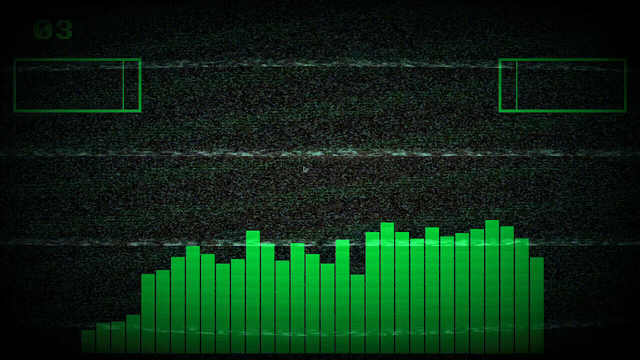
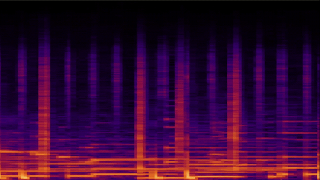
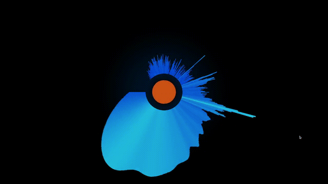
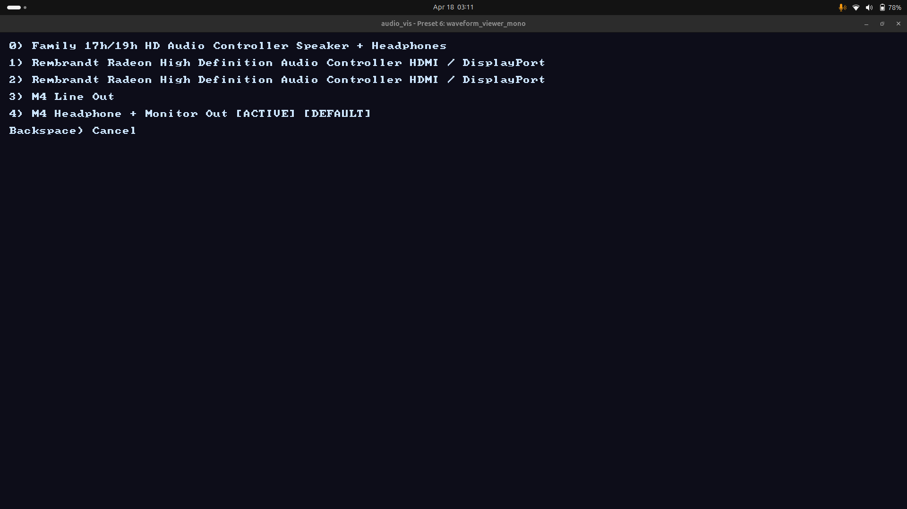

# audio_vis

A shader-driven, real-time audio visualization engine that captures your system audio and drives GLSL fragment shaders with FFT, peak/RMS, raw sample, and/or feedback buffer data each frame. Write shaders, tweak a config file, and see changes instantly with hot-reloading. Currently supports Linux x86_64/aarch64 (desktop and Raspberry Pi 4+)

Use this for live visuals, desktop audio-reactive backgrounds, shader experimentation, or as a foundation for other creative coding projects. All of the audio pipeline in particular is made to be reusable and modular for other projects with very few changes.




## Features

- Real-time system audio capture and analysis
- Configurable FFT output with multiple interpolation and collation strategies
- Peak/RMS metering with per-channel or mono-summed output
- Asymmetric temporal smoothing and peak hold tracking
- Feedback buffer system for ping-pong effects, spectrograms, trails, and particle systems
- Texture loading for image-based effects
- Font loading for any .ttf for text-based effects
- Expression parser for dynamic buffer sizing based on window dimensions, sample rate, and more
- Hot-reload shaders, configs, textures, and fonts on save, no restart needed
- Built-in error display shader for compile and parse errors
- Built-in audio device menu to choose which system output to analyze
- Built-in bitmap font for on-screen text rendering

## Screenshots








## Download

Download the latest release from the [Releases](https://github.com/cwiggins12/audio_vis/releases) page. The release includes the executable, example shaders, and a Shader Authoring Guide to help anyone get started.

Linux only for now. Windows support is planned.

### Requirements

- A PulseAudio or PipeWire system with a monitor capture device
  If none of the example shaders seem to be getting input, you may need to 
  enable one in your audio settings and/or install PulseAudio/PipeWire. I made a
  section specifically for this issue in docs/SHADER_AUTHORING.html at the
  bottom to, hopefully, help anyone who may run into this.
- OpenGL ES 3.1 capable GPU
- GLFW runtime libraries (`sudo apt install libglfw3` on Debian/Ubuntu)
- FFTW3 runtime libraries (`sudo apt install libfftw3-3` on Debian/Ubuntu)
- Raspberry Pi 4 and up only: Mesa V3DV

### Tested Hardware

- Desktop Linux (x86_64, Ubuntu 24.04.4 LTS)
- Raspberry Pi 4 (aarch64, Raspberry Pi OS 64-bit)

### Running

Extract the release and run the executable from within the `audio_vis` directory:

```
cd audio_vis
./audio_vis
```

The `shaders/` directory and `audio_vis` executable must stay in the same directory.


## Controls

| Key | Action |
|-----|--------|
| Left Arrow | Previous shader preset |
| Right Arrow | Next shader preset |
| Up Arrow | Toggle fullscreen |
| Down Arrow | Random shader |
| Backspace | Enter/exit audio device selection menu |
| 0 - 9 | In device selection menu, selects device |
| Escape | Quit |


## Writing Shaders

Each shader is a subdirectory inside `shaders/` containing a `frag.glsl` and an optional `spec.cfg`. The full documentation is in the included `SHADER_AUTHORING.html`, which you can open in any browser.

A minimal shader:

```glsl
void main() {
    vec2 uv = uvBottomLeft();
    int bin = int(uv.x * float(fftArrSize));
    float val = fftData[clamp(bin, 0, fftArrSize - 1)];
    FragColor = vec4(vec3(val), 1.0);
}
```

Save your `frag.glsl` and the engine picks up changes automatically.


## Building from Source

### Linux / Raspberry Pi OS

#### Dependencies
Install the following:
```
sudo apt install cmake build-essential git libglfw3-dev libfftw3-dev libegl-dev libgles-dev pkg-config
```

#### Build
```
git clone https://github.com/cwiggins12/audio_vis.git
cd audio_vis
cmake -S . -B build
cmake --build build (add the -j4 flag on Raspberry Pi 4+)
cd build
```
The executable and shader directory will be in `build/`. Run from there:
```
./audio_vis
```

### Windows

#### Dependencies
Install the following:
- [CMake](https://cmake.org/download/) (3.16 or later, add to PATH during install)
- [MinGW-w64](https://www.mingw-w64.org/) (install via [MSYS2](https://www.msys2.org/) or standalone, add `bin/` to PATH)

GLFW and FFTW libraries are included in the repo under `libs/` — no additional downloads needed.

#### Build
```
git clone https://github.com/cwiggins12/audio_vis.git
cd audio_vis
cmake -S . -B build -G "MinGW Makefiles"
cmake --build build
cd build
```
The executable, shader directory, and `libfftw3f-3.dll` will be in `build/`. Run from there:
```
audio_vis.exe
```

### Common
This project also relies on the headers below that are all public domain found in `src/external/stb`:
- `stb_image.h`, `stb_truetype.h`, and `stb_rect_pack.h` from [Official STB GitHub](https://github.com/nothings/stb)
- `miniaudio.h` from [Official miniaudio GitHub](https://github.com/mackron/miniaudio)

GLAD (OpenGL 4.4 / OpenGL ES 3.1 loader) is included in the repo under `src/external/glad/`.


## Issues and Contribution

Got any suggestions for features you would like to see? Check out the [Planned Additions Document](planned_additions.txt) and see if its already on the way. If you don't see it, reach out to me at my email or through this GitHub account and I'll add it to the list!

Found a bug or have a suggestion? Open an issue on [GitHub Issues](https://github.com/cwiggins12/audio_vis/issues) or email me at my email.

Want your shader added to the examples? Email me with your shader directory (frag.glsl, spec.cfg, and any textures), and I'll add it!


## Author

**Cody Wiggins**

 - codywigginsdev@gmail.com

 - [Development Blog](https://codywigginsdev.neocities.org/) - Weekly updates about what I am working on and a collection of prior projects
