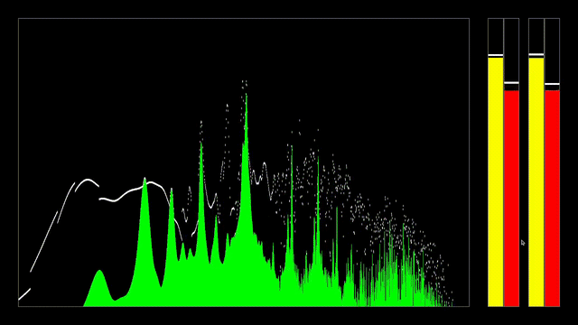
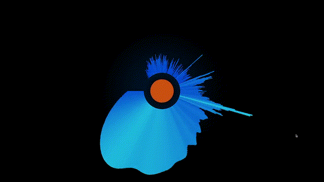

# audio_vis

A real-time audio visualization engine that captures your system audio and drives GLSL fragment shaders with FFT, peak/RMS, and feedback buffer data each frame. Write shaders, tweak a config file, and see changes instantly with hot-reload. Currently supports Linux (desktop and Raspberry Pi 4+)

Use this for live visuals, desktop audio-reactive backgrounds, shader experimentation, or as a foundation for other creative coding projects. All of the audio pipeline in particular is made to be reusable and modular for other projects with very few changes.


## Features

- Real-time system audio capture and analysis
- Configurable FFT output with multiple interpolation and collation strategies
- Peak/RMS metering with per-channel or mono-summed output
- Asymmetric temporal smoothing and peak hold tracking
- Feedback buffer system for ping-pong effects, spectrograms, trails, and particle systems
- Texture loading for image-based effects
- Expression parser for dynamic buffer sizing based on window dimensions, sample rate, etc.
- Hot-reload shaders and configs on save, no restart needed
- Built-in error display shader for compile and parse errors
- Built-in bitmap font for on-screen text rendering

## Screenshots






## Download

Download the latest release from the [Releases](https://github.com/cwiggins12/audio_vis/releases) page. The release includes the executable, example shaders, and a Shader Authoring Guide to help anyone get started.

Linux only for now. Windows support is planned.

### Requirements

- A PulseAudio or PipeWire system with a monitor capture device
  If none of the example shaders seem to be getting input, you may need to 
  enable one in your audio settings and/or install PulseAudio/PipeWire. I made a
  section specifically for this issue in the docs/SHADER_AUTHORING.html file at the
  bottom to, hopefully, help anyone who may run into this.
- OpenGL ES 3.1 capable GPU
- GLFW runtime libraries (`sudo apt install libglfw3` on Debian/Ubuntu)
- FFTW3 runtime libraries (`sudo apt install libfftw3-3` on Debian/Ubuntu)
- Raspberry Pi 4 and up only: Mesa V3DV

### Tested Hardware

- Desktop Linux (x86_64, Ubuntu 24)
- Raspberry Pi 4 (aarch64, Raspberry Pi OS)
- Warning: Shaders using a resolution based feedback buffer may have their buffer set to 0 when on a Raspberry Pi 4 and up if the buffer's size is larger than what the device allows

### Running

Extract the release and run the executable from within the `audio_vis` directory:

```
cd audio_vis
./audio_vis
```

The `shaders/` directory and `audio_vis` executable must stay in the same directory. Make sure audio is playing on your system before or after launching.


## Controls

| Key | Action |
|-----|--------|
| Left Arrow | Previous shader preset |
| Right Arrow | Next shader preset |
| Up Arrow | Toggle fullscreen |
| Down Arrow | Random shader |
| Escape | Quit |


## Writing Shaders

Each shader is a subdirectory inside `shaders/` containing a `frag.glsl` and an optional `spec.cfg`. The full documentation is in the included `SHADER_AUTHORING.html`, which you can open in any browser.

A minimal shader:

```glsl
void main() {
    vec2 uv = uvBottomLeft();
    int bin = int(uv.x * float(fftArrSize));
    float val = fftData[clamp(bin, 0, fftArrSize - 1)];
    FragColor = vec4(vec3(val), 1.0);
}
```

Save your `frag.glsl` and the engine picks up changes automatically.


## Building from Source

### Dependencies

Install the following:

```
sudo apt install cmake build-essential libglfw3-dev libfftw3-dev libegl-dev
```

You will also need to place single-header libraries in `src/external/`:

- `stb_image.h` from [Official STB GitHub](https://github.com/nothings/stb)
- `miniaudio.h` from [Official miniaudio GitHub](https://github.com/mackron/miniaudio)

Sorry for the extra step, but I didn't feel comfortable reuploading such great work, and I figured most folks would already know how to get ahold of the stb headers and miniaudio easily anyway.
GLAD (OpenGL ES 3.1 loader) is included in the repo under `src/external/glad/`.

### Build

```
git clone https://github.com/cwiggins12/audio_vis.git
cd audio_vis
mkdir build && cd build
cmake ..
make -j$(nproc)
```

The executable and shader directory will be in `build/`. Run from there:

```
./audio_vis
```

### Compiler Notes

Tested with GCC and Clang on Ubuntu 24. C++20 required. If using GCC, `stb_image` may benefit from the `-msse2` flag for SIMD optimizations.


## Issues and Contribution

Got any suggestions for features you would like to see? Check out the [Planned Additions Document](planned_additions.txt) and see if its already on the way. If you don't see it, reach out to me at my email or through GitHub and I'll add it to the list!

Found a bug or have a suggestion? Open an issue on [GitHub Issues](https://github.com/cwiggins12/audio_vis/issues) or email me at the email below.

Want your shader added to the examples? Email me with your shader directory (frag.glsl, spec.cfg, and any textures).


## Author

**Cody Wiggins**

 - codywigginsdev@gmail.com

 - [Development Blog](https://codywigginsdev.neocities.org/) - Weekly updates about what I am working on and a collection of prior projects
